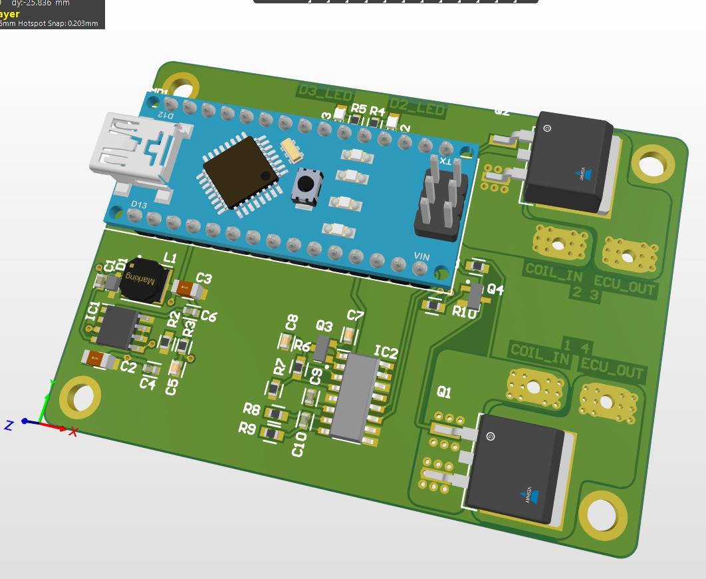

# quickshiftuino
## Overview
Quickshiftuino is a simple device that detects the shift motion in the gear lever linkage and cuts the ignition coil power for a specified time.
This enables clutchless upshifting (and in some situations downshifting) by unloading the gearbox and drivetrain.

The cutoff time is dependant on engine RPM and is linearly scaled bewtween the lowest RPM (minRPM) and highest RPM (maxPRM).

My main idea was to keep it simple so it's as universal as possible. That's why I chose to use an Arduino Nano as the MCU for the first revision.

 

The V1 PCB had a few issues with the power switching logic (high side P-MOS was wired incorrectly):

 

## Shift detection
Shift lever pressure can be measured in two different ways with quickshiftuino.

  ### 1. Load cell
  The PCB features an HX711 load cell amplifier circuit.
  A DYMH-103 load cell needs to be installed in the shift rod to sense actual force.
  This method is more complex since in most cases the shift rod needs to be cut and modified but you will also get more consistent results.
  Another benefit is that up- and downshifts are clearly distinguishable because of positive and negative readings.

  ### 2. Piezo quickshifter sensor
  These sensors are all around Aliexpress if you search for quickshifter parts. A few big companies are using something similar with success already (e.g. Healtech, Starlane).
  This sensor doesn't react to force but it detects force change or momentum. The applied force can be more than enough but the sensor doesn't output a big voltage if you're shifting really soft and slow.
  The main drawback is that it only gives reliable results when mounted on the gearbox shaft clamp. That way there won't be a signal difference between up- and downshifts though.
  Installation is really easy compared to the loadcell and mounted correctly it's barely noticeable.

 

## Future plans
Currently I am working on the second revision of the PCB which will have a few major issues resolved (mainly power switching logic).
I'm also thinking about either switching to an ESP32 MCU or adding a bluetooth module to the PCB. This should enable changing configuration values without the need for a computer and Arduino IDE.

The V1 PCB design will be added and I will upload a few pictures and videos of the project in a few weeks.

First test in the garage as a proof of concept: Video[https://youtu.be/FZ6roKEg_gY]
