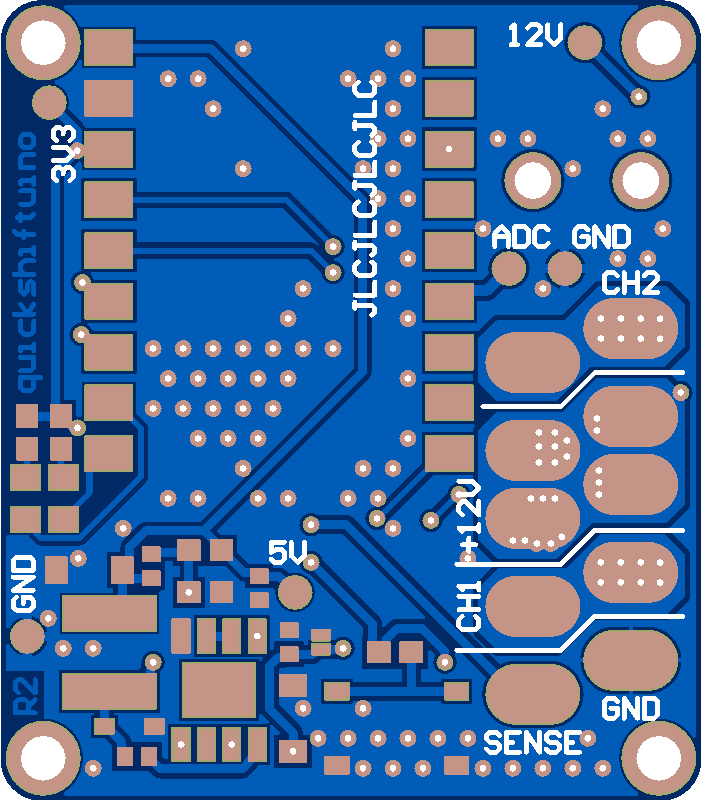
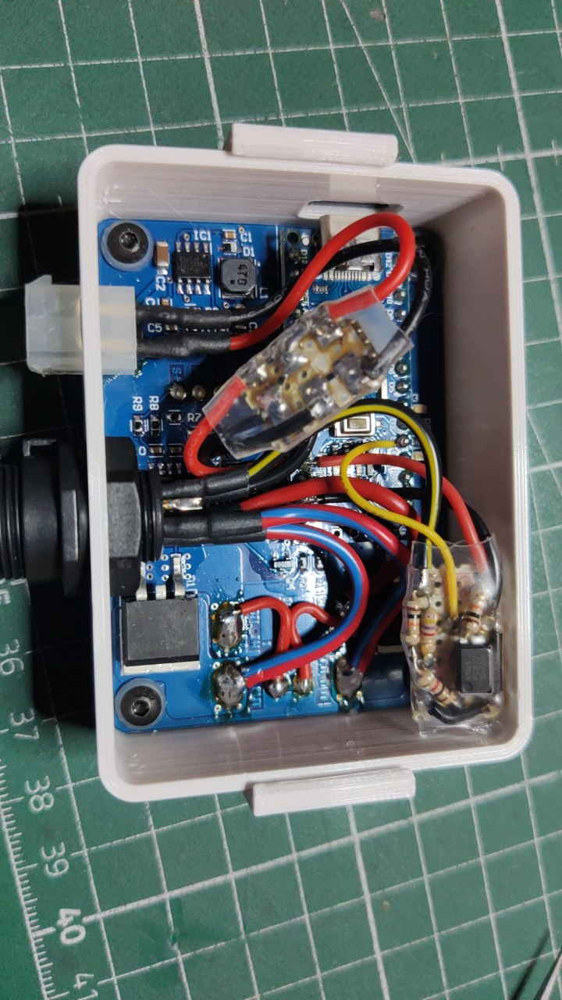

# quickshiftuino
<<<<<<< Updated upstream
## Latest development (edited 21.08.2024)
The new dimensions are 40 x 35 mm so it's also a LOT more compact now.
Gerber files and schematics are already available but still work in progress

The second revision PCBs are currently being tested and seem to be working fairly stable. A few components need some more protection or higher voltage tolerance to ensure that they don't break in extreme conditions.
I ordered some new tiny PCBs to hold a SOT23-3 hall sensor. The two stage ignition switching does a great job at reducing abrupt power engagement but it takes some tuning to get right. I'm hoping with the new hall sensor setup it will be much easier to get running perfectly smooth. Previous experiments have proven that this approach works well.

=======
## Latest development (edited 02.10.2024)
The third revision (R3) PCB is done and ordered. I added Molex Picoblade connectors to the board for two hall sensor connections without soldering. The dimensions increased slightly from 35x40mm to 42x40mm.
Vias are now also tented to prevent short circuits between Quickshiftuino PCB and the piggyback ESP32 Mini.
Currently I'm developing a hall pressure sensor that mounts at one end of the shift rod. 3D printed prototypes already give promising results, aluminium CNC milled parts are going to arrive in 2 weeks.

Gerber files will be available after I did some testing.

Previous R2 PCB that's almost the same as R3:

>>>>>>> Stashed changes

 

## Overview
Quickshiftuino is a simple device that detects the shift motion in the gear lever linkage and cuts the ignition coil power for a specified time.
This enables clutchless upshifting (and in some situations downshifting) by unloading the gearbox and drivetrain.

The cutoff time is dependant on engine RPM and is linearly scaled bewtween the lowest RPM (minRPM) and highest RPM (maxPRM).
An alternative to fixed cut-times would be a hall sensor and magnet mounted to the gearbox shift shaft to detect once the gearbox dog rings are touching or fully engaged.

My main idea was to keep it simple to use and universal. In total there are 6 possible configurations that have different advantages and disadvantages.

Configuration is possible though a locally hosted web-interface. Simply connect to the WiFi network provided by the device.
http://192.168.4.1/ gives access to the config page.
http://192.168.4.1/debug.html/ shows output values of the selected sensors and the current RPM value. This is helpful for finetuning parameters.

 

The R1 PCB had a few issues with the power switching logic (high side P-MOS was wired incorrectly):

For R2 many little bugs were resolved and the size drastically reduced.
The MCU was also switched from an Arduino Nano to a much more powerful and compact ESP32 Mini (Waveshare).

 

## Shift detection
Shift lever pressure can be measured in two different ways with quickshiftuino.

  ### 1. Piezo quickshifter sensor
  These sensors are all around Aliexpress if you search for quickshifter parts. A few big companies are using something similar with success already.
  This sensor doesn't react to force but it detects force change or momentum. The applied force can be more than enough but the sensor doesn't output a big voltage if you're shifting really soft and slow.
  The main drawback is that it only gives reliable results when mounted on the gearbox shaft clamp. That way there won't be a signal difference between up- and downshifts though. Installation is probably the easiest out of all.
  
  ### 2. Hall Sensor pressure sensor
  This is the latest option and still under development. Current tests show really good results and easy setup. The required parts are a bit pricier than the Piezo sensor though. A hall sensor measures the movement of a spring loaded mechanism that's mounted in the shift rod. Due to it being fairly low profile a modification of the shift rod might not be required on many bikes.

  ### 3. Load cell (not supported yet)
  The PCB features an HX711 load cell amplifier circuit.
  A DYMH-103 load cell needs to be installed in the shift rod to sense actual force.
  This method is more complex since in most cases the shift rod needs to be cut and modified but you will also get more consistent results.
  Another benefit is that up- and downshifts are clearly distinguishable because of positive and negative readings.

 

## Future plans
  ### Software ToDo's
  - Add hysteresis for hall sensor pressure sensor to prevent continuous triggering when holding the shift lever up in top gear
  - Instead of measuring ignition pulses in a fixed timespan: Set up timer that resets with each ignition pulse (RPM way more precise and faster update rate)
  - Long term: Improve efficiency of config GUI code and move all non-quickshifter tasks to second MCU core (enables faster loop times, probably not necessary)
  - Fun project: 2-step RPM limiter for launch control or just cool flames out of the exhaust (relies on quick and precise RPM measurement)
  - Fun project: Add support for shift indicator LED using free GPIO pad on R3 PCB (could also be used for other practical indicators)
  
Currently I am working on the second revision of the PCB which will have a few major issues resolved (mainly power switching logic).
I'm also thinking about either switching to an ESP32 MCU or adding a bluetooth module to the PCB. This should enable changing configuration values without the need for a computer and Arduino IDE.

The V1 PCB design will be added and I will upload a few pictures and videos of the project in a few weeks.

First test in the garage as a proof of concept: Video[https://youtu.be/FZ6roKEg_gY]
